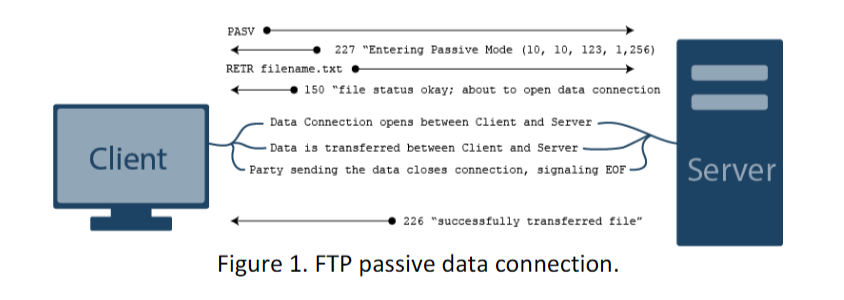

# CNT 4713 – Project 1

## Overview:
Understand TCP socket programing by implementing a simplified FTP client that works in the passive mode. You must create your own socket, and cannot use any existing FTP library. You may use Python3, Java, C++, or C as the programming language.

## Background:
The File Transfer Protocol (FTP) is a TCP based application layer protocol for transferring files between a client and a server. FTP is built on the client–server architecture using separate control and data TCP connections. Usage of FTP client commands is explained in [1].

When an FTP client starts a FTP session with a server, it first initiates a control TCP connection with the server at server port number 21. The client then sends the user identification and password over this control connection. The client also sends, over the control connection, various commands to the server.

When the client is about to transfer a file (either to, or from, the server), it sends the PASV command over the control connection to the server, and the server responds with the IP and port number, to which the client will initiate the second TCP connection, i.e., the data connection, to transfer the file, as illustrated in Figure 1 below.



*Figure 1. FTP passive data connection.*

FTP sends exactly one file over the data connection and then closes the data connection. If, during the same session, the user wants to transfer another file, FTP opens another data connection. Thus, with FTP, the control connection remains open throughout the duration of the user session, but a new data connection is created for each file transferred within a session.

The commands, from client to server, and replies, from server to client, are sent across the control connection in 7-bit ASCII format. In order to delineate successive commands, a carriage return and line feed end each command. Each command consists of four uppercase ASCII characters, some with optional arguments. Some of the commands are given below:

- **USER username**: Used to send the user identification to the server.
- **PASS password**: Used to send the user password to the server.
- **LIST**: Used to ask the server to send back a list of all the files in the current remote directory. The list of files is sent over a (new and non-persistent) data connection rather than the control TCP connection.
- **CWD pathname**: Used to change the working directory on the server.
- **RETR filename**: Used to retrieve (that is, get) a file from the current directory of the server. This command causes the server to initiate a data connection and to send the requested file over the data connection.
- **STOR filename**: Used to store (that is, put) a file into the current directory of the server.
- **DELE filename**: Used to delete a file in the current directory of the server.
- **QUIT**: Used to terminate the current FTP session.

A complete list of the commands is available in the FTP RFC [2].

## Instructions:
In a nutshell, you are developing an FTP client that is similar to the Windows/Linux/MacOS built-in command line FTP client. So you can run the built-in client, and try to replicate its behavior. A program skeleton in Python3 is provided in Canvas for you to get started.

The FTP client should be started by typing:

```
myftp server-name
```
or
```
java myftp server-name
```
or
```
python myftp.py server-name
```

where "server-name" is the name or IP address of the server. **Please make sure that your program name is exactly myftp. Submissions will be graded by an automated script. Unrecognized program names will result in a zero.**

After the client starts, it should display a prompt for entering the FTP username, followed by a prompt for entering the password. After a successful login, the following commands should be available in the FTP client prompt:

| Command | Function |
|---------|----------|
| `myftp> ls` | List the files in the current directory on the remote server. |
| `myftp> cd remote-dir` | Change the current directory to "remote-dir" on the remote server. |
| `myftp> get remote-file` | Download the file "remote-file" from the remote server to the local machine. |
| `myftp> put local-file` | Upload the file "local-file" from the local machine to the remote server. |
| `myftp> delete remote-file` | Delete the file "remote-file" from the remote server. |
| `myftp> quit` | Quit the FTP client. |

All the directory/file names in the commands should be considered relative to the current directory (unless absolute path name is given). All the commands (including entering the user name and password) when executed should return a Success/Failure status. After a successful file transfer, a success message should be displayed with the number of bytes transferred.

## Test:
Run the Windows/Linux/MacOS built-in command line FTP client to see the expected output of each command. Analyzing the transmitted message using Wireshark [3] will help you understand the implementation.

You may test your program by connecting it to inet.cs.fiu.edu (user: demo, password: demopass) or a FileZilla server [4] that can be installed on your Windows machine.

## References:
[1] Basic FTP Commands, http://www.cs.colostate.edu/helpdocs/ftp.html

[2] FTP RFC, http://www.ietf.org/rfc/rfc959.txt

[3] Wireshark Packet Analyzer, https://www.wireshark.org/#download

[4] FileZilla Server for Windows, https://filezilla-project.org/download.php?type=server

## Group:
You work in a group of up to three. Only one submission is necessary for a group.

## Submission:
**Submit a copy of your final code to Canvas.** (Source code only, no NetBeans/Eclipse… project files)

**Submit a readme.txt to Canvas with the following information:**
1. Member names and IDs
2. Language used: Python3/Java/C++/C
3. Compiling instructions (not necessary for Python): command-line compiling instructions only, no NetBeans/Eclipse… compiling.

## Grading:
Your program will be tested using the inet.cs.fiu.edu server.

| Item | Percentage |
|------|------------|
| login | 15% |
| ls | 15% |
| cd | 15% |
| get | 15% |
| put | 15% |
| delete | 15% |
| quit | 10% |

Code plagiarism will be reported for academic dishonesty.
